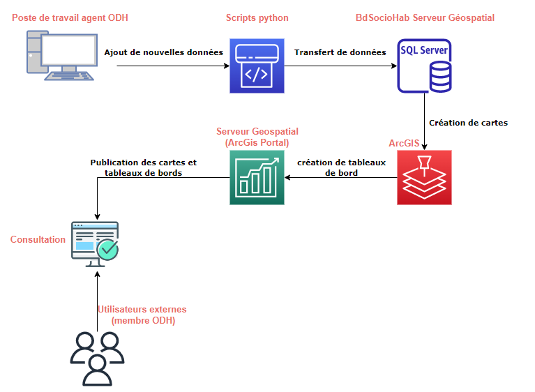
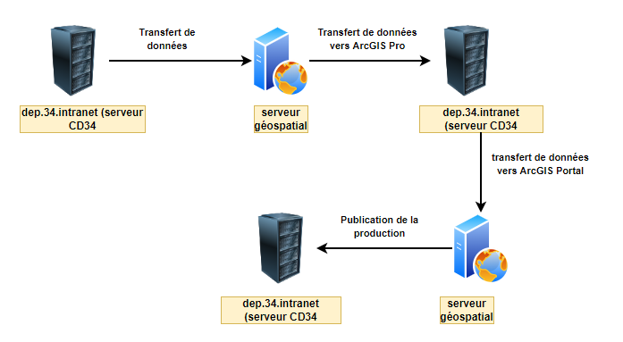
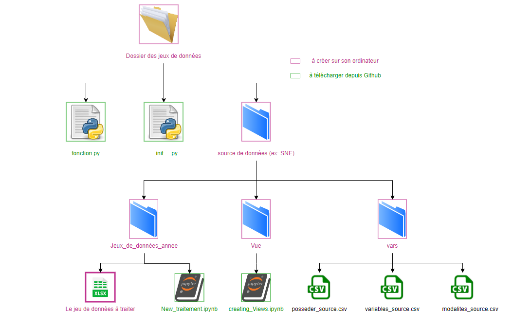

# Modernisation de l'ODH

## Logiciels prérequis

- pgAdmin (Version 4)
- Anaconda
- ArcGIS Portal
- ArcGIS Pro

## Besoins fonctionnels

Ce projet vise à transférer des jeux de données Excel de l'ODH stocké localement vers un système de gestion de base de données PostgreSQL (PgAdmin4) et à créer un tableau de bord pour suivre l'évolution des indicateurs utilisés par l'observatoire.

Il consiste donc  à :

- écrire une fonction python qui permet de charger les données de n’importe quelle source de de données (SNE, FSL, …) vers la base de données « BDSOCIOHAB »  logée dans le serveur geospatial, et partagé avec le service SIG.
- création de tableaux de bord représentant les fiches de synthèse précédemment créé dans Excel, ainsi que des cartes avec les données stockées dans la base de données « BDSOCIOHAB ». Tout ceci à travers ArcGIS (Pro et Portal).
- chargement des tableaux de bord  sur le site internet de l’ODH.

La réalisation de ce projet permet à l’ODH de :

- gagner en efficacité de production de ses fiches de synthèse
- d’avoir un système de veille de ses indicateurs
- et une meilleure visibilité de ses services.

## Besoins non fonctionnels

| **Elément** |   **Valeur**   |**Commentaires**|
|---------------|:-----------:|:---------------:|
| Editeur de base de données | PostgreSQL 11  | Serveur Géospatial |
| Ecriture des scripts python | Python 3 via Jupyter Notebook | Environnement sur  Anaconda Version 3.4 |
| Création des cartes et tableaux de bord | ArcGIS version 10.8 | Logiciel pour l’édition des cartes et portal pour réaliser les tableaux de bord 
| Chargement des cartes sur le site l’ODH | | web |
| Sauvegarde des scripts |  Git Bash | Compte et logiciel de versionnement de scripts | 

## Représentation fonctionnelle

## Liste des environnements
On travaille sur un environnement avec la version 3 de python (demander des droits pour télécharger des packages).

- Un environnement Jupyter avec ces packages ci-dessous à télécharger (soit directement via l’interface d’Anaconda, soit télécharger faire un «!pip install ‘le_nom_du_package’»
- Compte pgAdmin4 sur le serveur de base donnée partagé avec le service SIG (il faut faire une demande de droits)
- Windows Server 
- Un compte Github

| **Environnement** | **Type** |**OS**| **vCPU**| **RAM GB** | **Stockage** |**Réseau** |
|:-----------------:|:--------:|:----:|:-------:|------------|:------------:|:---------:|
| Jupyter( psycopg2,  unidecode,  glob,  shutil,  os) | VM  | Windows server 10 | 8 | 16 | | Internal |
| PgAdmin 4 | VM | Windows server 10 | 8 | 16 | | Internal |
| GitBash |  | Windows server 10 |  |  | | Internal |

***

# Représentation infrastructure

## Décisions d’architecture

